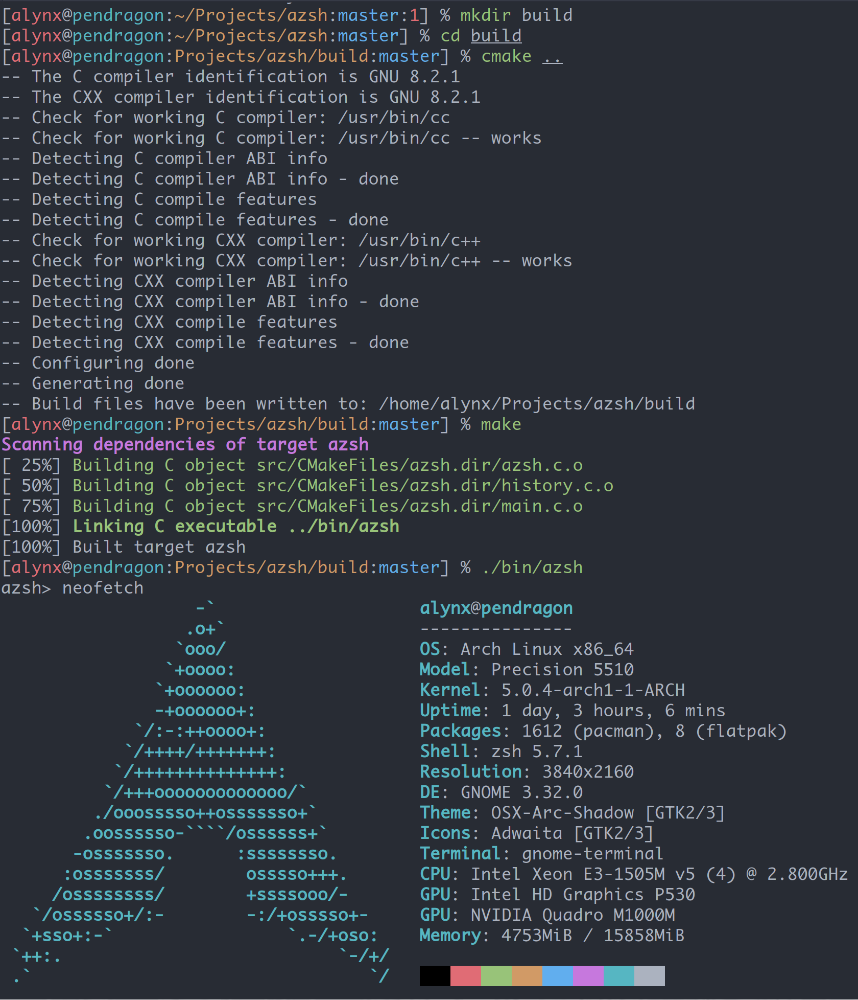
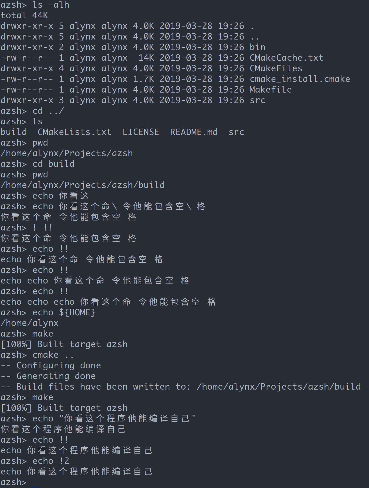

Operating System Project 1: Shell
=================================

16281123 Zhou Daye CS 1603
--------------------------

# Overview

This project implements a simple shell in C, which can run in Linux distros. This project also implements some features like escape char sequence, multi-line command support and history support.

# Process control method

Under linux, `fork()` in `unistd.h` can create a sub-process from a process, we can detect parent or child by the pid `fork()` returns. And `exec` series system call can replace process with another program.

Basically this program read and parse strings into arguments, then fork a child to run program with `execvp()`, and wait child to exit.

# Design

It works in a loop: Read, Parse, Exec.

When loop starts, it read it's history file `~/.azhistory` to load history, then starts `azsh_readline()` to read user input: if user has a long command, he can use `\` in line end and continue to write command in next line.

`azsh_parse_args()` reads line and splits it into tokens, and store char pointer in a array to return. `azsh_run_command()` can pass this array to `execvp()`, or call internal funtion like `_azsh_cd()` or `_azsh_pwd()`.

# Snapshots

# Limitation

I think shell actually uses lexer, it builds a grammer tree to parse input, however I didn't implement this, because I don't have enough time.

Using basic char in C cannot handle CJK characters (you can see in screenshots), needs UTF-8 support.
